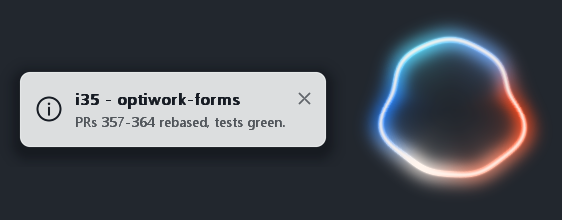
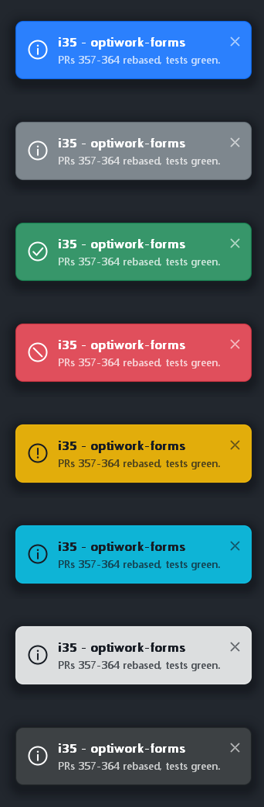

# speaker

A single, self-contained Windows binary that speaks text out loud and shows a
glowing orb on screen while it talks.

<p align="center">
  
</p>
<p align="center"><em>silent → speaking → loud → silent</em></p>

No Python. No server to start. No `ffplay` to pipe into. One `speak.exe` (plus
`onnxruntime.dll`) that loads the [Pocket TTS](https://github.com/kyutai-labs/pocket-tts)
model, renders audio straight to your speakers through WASAPI, and pulses a
click-through overlay in the corner of the screen in time with the voice.

```
speak.exe --serve             &:: once: resident daemon holding the model
speak.exe "Hello world."      &:: ~100 ms to first audio
```

## Why

Local TTS setups usually end up as a Python server plus a shell pipeline into an
audio player. That means a Python install, a virtualenv, a process to keep alive
and a port to remember — a lot of moving parts to say one sentence. This is the
same thing as one native binary you can copy anywhere.

It also gives you something to *look at*: when a machine starts talking, a
small visual cue tells you where the sound is coming from and that it is still
going. The orb fades in with the first sample, pulses with the actual amplitude
of what the speakers are playing right now, and fades out when the audio drains.

## Features

- **One binary** — inference, playback, daemon and UI in a single `speak.exe`
- **~100 ms to first audio** with the resident daemon (vs ~5.7 s loading per call)
- **No Python at build time or run time** — pre-exported ONNX weights, fetched by a script
- **Voice cloning** — any short WAV/MP3/FLAC sample becomes the voice; `make-voice.ps1` joins several takes into one
- **Audio-reactive orb** — per-pixel-alpha layered window, always on top, parked above the taskbar
- **Caption toast** — an icon, a title and a line of context beside the orb, in the Bootstrap variants, so you also see *what* it is about
- **Click the orb to pause**, click again to resume from the same word
- **Points at a window** — expanding rings that say "over here", by flag or over HTTP
- **Streaming** — audio starts playing while the rest of the sentence is still being generated
- **Optional WAV output** — `--save out.wav` alongside (or instead of) playback
- **UTF-8 / accents** — arguments are read as wide chars, so `"Olá, tudo bem?"` works

## Requirements

- Windows 10/11 x64
- [Visual Studio 2022 Build Tools](https://visualstudio.microsoft.com/downloads/) with the
  **Desktop development with C++** workload (ships the CMake and Ninja used by `build.bat`)
- ~200 MB of disk for the models

## Build

```bat
build.bat
```

That is the whole setup. CMake fetches ONNX Runtime 1.23.2 (prebuilt),
SentencePiece and dr_libs, downloads the pinned `pocket_tts.cpp` inference
engine, and links everything into `speak.exe`. First build takes a few minutes;
later builds are seconds.

If your Build Tools live somewhere else, edit `VSBT` at the top of `build.bat`.

### Get the models

```powershell
pwsh -File get-models.ps1
```

Downloads the six INT8 ONNX files (~200 MB) into `models/` from
[KevinAHM/pocket-tts-onnx](https://huggingface.co/KevinAHM/pocket-tts-onnx).
This is what keeps Python out of the picture — the upstream project generates
these with a torch-based export script, and this repo just uses the exported
result.

### Get a voice

Voice cloning is zero-shot, so a voice is just an audio file in `voices/`:

```
voices/
└── jarvis.wav      ← 5–30 s of speech, any WAV/MP3/FLAC
```

Point at it with `--voice jarvis.wav` (or pass an absolute path to any file).
The default is `jarvis.wav`. First use of a voice costs conditioning time —
a few hundred ms for a short sample, several seconds for a 20 s+ one — after
which it is cached in `voices/.cache/` and reloads in ~4 ms.

**Several short recordings?** The engine conditions on one file (and uses at most
30 s of it), so join them first:

```powershell
pwsh -File make-voice.ps1 -Out voices/mine.wav take1.wav take2.m4a take3.mp3
```

That resamples each clip to 24 kHz mono, trims leading/trailing silence,
loudness-normalizes them so takes recorded at different levels do not fight each
other, joins them with a 0.25 s gap, and caps the result at 30 s. Add `-Denoise`
for sources with background hiss — an FFT denoiser, which will not remove music
or a second voice.

Aim for at least ~5 s of speech. Length matters: in a four-way blind listen, a
28 s denoised sample beat a 5 s clean one, so do not throw away a longer take
just because it is noisier — build both and compare by ear.

## Usage

```bat
speak.exe "Hello world."
speak.exe --voice narrator.wav "A different voice."
speak.exe --save out.wav "Speak and keep a copy."
speak.exe --no-orb "Speak with no overlay."
speak.exe --caption-title "o-cli #85" --caption "CI green." --caption-variant success "The pull request is ready."
speak.exe --dump-orb orb.bmp          rem render one orb frame and exit
```

Click the orb while it is speaking to pause, and again to resume.

| Flag | Default | Description |
|------|---------|-------------|
| `--voice <name\|path>` | `jarvis.wav` | Voice sample; bare names resolve inside `--voices-dir` |
| `--save <file.wav>` | — | Also write the audio to a 32-bit float WAV |
| `--no-orb` | — | Skip the on-screen indicator |
| `--caption <text>` | — | One short line of context, shown as a toast left of the orb |
| `--caption-title <t>` | — | The caption's title line, above that text |
| `--caption-variant <v>` | `light` | Toast colour: `primary`, `secondary`, `success`, `danger`, `warning`, `info`, `light`, `dark` |
| `--caption-icon <i>` | per variant | Override the icon: `none`, `check`, `info`, `warn`, `ban`, `dot` |
| `--caption-opacity <n>` | `100` | How solid the toast is, `0`–`100` |
| `--orb-style <s>` | `aurora` | `aurora` (glowing ring) or `dot` (solid core) |
| `--orb-size <px>` | `220` | Square size of the overlay |
| `--dump-orb <file.bmp>` | — | Render a single orb frame to a BMP and exit |
| `--orb-preview <prefix>` | — | Render a strip of frames across time and loudness, and exit |
| `--timing` | — | Report milliseconds to first audio, and which path served it |
| `--point` | — | Ring out a window (see [Pointing](#pointing-at-a-window)); alone it only points, with text it speaks first |
| `--title <substr>` | — | Point at the window whose title contains this (implies `--point`) |
| `--hwnd <n>` / `--at <x,y>` | — | Point at a window handle / a screen position (imply `--point`) |
| `--pulses <n>` | `3` | Rings to send out |
| `--duration <s>` | `3.5` | Seconds the whole gesture lasts; the pacing scales to fit |
| `--color <c>` | `ember` | Colour the rings are built from: a name, `#rrggbb`, or `r,g,b` |
| `--size <px>` | `320` | Square size of the pointer overlay |
| `--point-preview <prefix>` | — | Render a strip of pointer frames and exit |
| `--list-targets` | — | Print the pointable windows as JSON and exit |
| `--point-port <n>` | `port+1` | Daemon: port for the pointing endpoint |
| `--no-point-server` | — | Daemon: do not serve the pointing endpoint |
| `--serve` | — | Run as the resident daemon (see below) |
| `--status` / `--stop` | — | Inspect or stop the daemon |
| `--port <n>` | `8123` | Daemon port |
| `--keepalive <sec>` | `60` | Daemon: nudge itself every N seconds so it stays fast when idle |
| `--no-keepalive` | — | Daemon: let it go cold between calls |
| `--local` | — | Never use the daemon; always synthesize in-process |
| `--no-auto-serve` | — | Do not start a daemon in the background on a cold call |
| `--temperature <f>` | `0.7` | Sampling temperature |
| `--eos-extra <n>` | `4` | Extra frames generated after end-of-speech (`-1` = upstream auto) |
| `--eos-threshold <f>` | `-4.0` | End-of-speech threshold; lower cuts off later |
| `--threads <n>` | `0` | Thread budget (`0` = half the cores) |
| `--models-dir <dir>` | `<exe dir>\models` | ONNX model directory |
| `--voices-dir <dir>` | `<exe dir>\voices` | Voice sample directory |

Paths default relative to the executable, not the working directory, so
`speak.exe` works from anywhere once built.

## Captions

<p align="center">
  
</p>

The orb says *something is speaking*. A caption says **what about**:

```bat
speak.exe --caption-title "i35 - optiwork-forms" ^
          --caption "PRs 357-364 rebased on dev, tests green." ^
          "The forms batch is ready to merge."
```

That is the default card, above: `light`, with the neutral `ⓘ`. Colour is opt-in
(see below), so a caption never claims a meaning you did not ask for.

Both text flags are optional and independent — a caption can be a title alone, a
line alone, or both. The card sits to the left of the orb, which keeps its corner;
it grows leftwards to fit the text, up to `360 px` wide, wrapping the body over at
most three lines (a fourth is cut: this is a toast, not a paragraph). Sizes scale
with `--orb-size`. Click the × to dismiss the card; the orb stays.

### Variants

`--caption-variant` takes the Bootstrap set, in Bootstrap's own colours, each with
an icon and with light or dark ink chosen for contrast:

<p align="center">
  
</p>

| Variant | Icon | Variant | Icon |
|---|---|---|---|
| `primary` | ⓘ | `warning` | ⚠ (ringed `!`) |
| `secondary` | ⓘ | `info` | ⓘ |
| `success` | ✓ | `light` *(default)* | ⓘ |
| `danger` | ⃠ | `dark` | ⓘ |

`--caption-icon none|check|info|warn|ban|dot` overrides the icon when the colour is
right and the glyph is not. `light` is the default: a coloured card would claim a
meaning the caller never asked for. Worth knowing that on a dark desktop the
near-white card is the **loudest** of the eight, louder than `danger`, purely from
tonal contrast — which is what you want from a notification, and why `dark` is
there for when it should recede instead.

`--caption-opacity <0-100>` scales the whole card — fill, shadow, text and all —
so it can sit further back on a busy desktop without changing its colour. It
stays legible well below `70`.

The card is deliberately **not** made of the same material as the ring. An earlier
version was — translucent glass with a hairline edge carrying the ring's
ember→white→azure palette sweeping across it, brightening with the voice — and next
to a pulsing orb it read as two things throbbing at each other, with the moving hue
fighting the text it framed. This one is flat and still: solid fill, a hairline
edge (which is what gives `light` an edge on a pale desktop), and a soft drop
shadow. Only the fade is shared with the orb, so the pair still arrives and leaves
as one object.

Every mark on it is a signed distance field: one rounded-rectangle field gives the
silhouette, the hairline and — sampled a few rows up — the shadow, and the icons
and the × are unions of line segments, so they stay crisp at any `--orb-size`.

The text is rasterized once, when the process starts: GDI cannot draw into an
alpha channel, so each string is drawn white-on-black into a scratch DIB and its
luminance becomes the coverage mask that the per-frame colours are applied
through. `ANTIALIASED_QUALITY` matters here — ClearType's subpixel antialiasing
would leave colour fringes once luminance is reinterpreted as alpha.

## Low latency: the daemon

Loading the model costs ~5 s, and a one-shot process pays it *every* call. So
`speak.exe` can also be the resident process that holds the model, using
upstream PocketTTS.cpp's HTTP server:

```bat
speak.exe --serve            rem loads, warms up, primes the voice, then serves
speak.exe --status           rem "daemon ready" / "daemon starting up" / "no daemon"
speak.exe --stop
```

Speaking needs no extra flags — every call tries the daemon first:

```
speak.exe "text"
   │
   ├── daemon answers on 127.0.0.1:8123  →  stream PCM, play, ~80 ms  ← the fast path
   │
   └── nothing listening
         ├── start a detached `--serve` daemon in the background (for next time)
         └── synthesize this one in-process (~5.7 s), so nothing blocks on the warm-up
```

That means you never have to remember to start anything: the first call after a
reboot is slow, everything after it is fast. `--local` opts out of the daemon
entirely; `--no-auto-serve` keeps the fast path but never spawns anything.

Measured on this machine (INT8, 16 cores, no GPU) — time from launching the
command to hearing the first sample:

| | first audio |
|---|---|
| cold, in-process (`--local`) | ~5 700 ms |
| **warm, via daemon** | **~100 ms** |

Roughly 55× less latency. Three things get it that low:

- The daemon calls `warmup()` **and** synthesizes one throwaway phrase with the
  default voice at startup, so ONNX kernels and the voice's KV state are already
  hot when the first real request lands.
- The client hands partial HTTP chunks to WASAPI as soon as they arrive rather
  than waiting for a full chunk, and sets `TCP_NODELAY`.
- `onnxruntime.dll` (14 MB) is **delay-loaded**, so the client process never maps
  the inference library at all — worth ~30 ms of the budget on its own.

Start the daemon detached, so it is not tied to whatever shell launched it:

```powershell
Start-Process -FilePath .\speak.exe -ArgumentList '--serve' -WindowStyle Hidden
```

`--serve` never returns — it *is* the server — so a job-controlled background
launch (`speak.exe --serve &`, or an agent's background task) keeps it attached
and it dies when that job is cleaned up. Auto-spawned daemons use
`DETACHED_PROCESS` and are immune to this.

The daemon is a single instance per port, guarded by a named mutex, so extra
`--serve` calls exit harmlessly.

### Keepalive

An *idle* daemon gets slow again — the CPU clocks down and its working set gets
paged out, so the first call after a few quiet minutes measured 350–660 ms
instead of ~100 ms. Text length is not the factor here; idleness is.

So the daemon nudges itself with a throwaway word every 60 s (`--keepalive <sec>`,
`--no-keepalive` to turn it off). The nudge goes through the daemon's own HTTP
endpoint rather than calling the engine directly, so the server serializes it
against real requests instead of racing them. Each tick costs a fraction of a
second of CPU, and shows up in the daemon's log as a normal `POST /tts`.

## Pointing at a window

<p align="center">
  
</p>
<p align="center"><em>a ring leaving the point → two in flight → the tail fading</em></p>

Speech tells you *that* something finished; it does not tell you **where**. With
several agents running in several terminals, the useful next question is which
window to go back to. So `speak.exe` can also point at one: rings that expand out
of the window's centre and fade, three times over across ~3.5 s, and then nothing.

```bat
speak.exe --point --title "reviewer worker"   rem point at that window
speak.exe --title "reviewer worker" "Tests are green."   rem speak, then point
speak.exe --list-targets                     rem what --title can match, as JSON
speak.exe --point --at 1200,800 --pulses 2    rem a bare screen position
speak.exe --point --title dev --duration 8    rem slower, for a big screen
speak.exe --point --title dev --color red     rem a different kind of attention
speak.exe --point-preview p                   rem render the frames, no screen needed
```

`--point` is the mode; `--pulses`, `--duration`, `--color` and `--size` shape the
gesture (`--point-pulses` and friends are accepted too, if you prefer the prefix).

Pulses and duration are independent: one is how many rings, the other how long the
whole gesture takes. The built-in pacing is a `1.90 s` ring life and a `0.80 s`
gap — `0.8·pulses + 1.1` seconds — and `--duration` scales both to hit the total
you asked for, keeping their ratio so the rings still read as a sequence rather
than one thick pulse.

<p align="center">
  
</p>
<p align="center"><em><code>--color</code>: the default ember, then red, green, cyan</em></p>

Everything is derived from that one colour: rings are born white-hot and settle
into it as they expand, the thin line keeps a touch of white so it stays legible,
and the core dot's halo takes it too. Names (`red`, `amber`, `yellow`, `green`,
`cyan`, `azure`, `blue`, `violet`, `magenta`, `pink`, `white`, `steel`, `ember`),
`#rrggbb` and `r,g,b` all work; anything else is a usage error rather than a
silent fallback. So an agent can keep ember for "done" and use red for "this one
needs you".

No model and no audio device are involved, so a pointing call costs a process
start (~240 ms) whether or not a daemon is running.

The overlay is click-through everywhere — unlike the orb there is nothing on it
to click — and it points at *where the window is*, without raising it or taking
focus. A window that is behind others gets rings drawn over whatever covers it.

### Which window?

This is the part that needs care, and the reason `--title` exists. With no target
given, `speak.exe` works out where the call came from:

1. **`GetConsoleWindow()`**, for a classic conhost window, which owns a real
   window of its own.
2. Otherwise the **process tree**: under a ConPTY terminal that console is a
   hidden pseudo-console, and a tool child of an agent gets its own conhost
   besides — but the parent chain still reaches the terminal
   (`speak.exe ← bash ← claude ← pwsh ← WindowsTerminal.exe`), so it walks up and
   takes the first ancestor that owns windows. It stops before `explorer.exe` and
   the service layer: pointing at Program Manager or a heap of File Explorer
   windows would be worse than admitting defeat.

If that ancestor owns **more than one** window, the call fails (exit 3) and
prints the candidates as JSON instead of guessing. That is the normal case for
Windows Terminal, which serves every window from one process:

```console
> speak.exe --point
speak: windowsterminal.exe (pid 22788) owns 6 windows — pass --title to say which
[{"hwnd":526232,"pid":22788,"process":"windowsterminal.exe","title":"⠐ Explore speaking with a skill", ...}]
```

Nothing in the process tree, and nothing in Windows Terminal's UI Automation
tree, says which of those windows hosts a given pane — there is no pane or
session id exposed anywhere on the window. The window **title** is the only
discriminator, which is workable because terminals running an agent usually title
themselves after the task. Hence: pick from `--list-targets`, pass `--title`.

### The pointing endpoint

The daemon serves this on **the next port** (`8124` by default), from its own
listener bound to `127.0.0.1` — it moves things on someone's screen, so it never
leaves the machine:

```console
$ curl -s -X POST http://127.0.0.1:8124/point -d '{"title":"reviewer worker"}'
{"ok":true}

$ curl -s http://127.0.0.1:8124/targets      # same list as --list-targets
$ curl -s http://127.0.0.1:8124/health
{"ok":true,"service":"speak-pointer"}
```

`POST /point` takes `title`, or `hwnd`, or `x` and `y`, plus optional `pulses`,
`duration`, `color` and `size` — the flags' JSON counterparts, same defaults, and
an unparseable colour is a 400 rather than a silent ember. It must be told a
target: the caller is at the other end of a socket,
so the daemon's own process tree says nothing about where the request came from.
It answers when the animation has finished (~3.5 s for three rings), and requests
queue rather than overlapping.

This is a separate listener rather than a new route on upstream's `TTSServer`,
whose routing is hardcoded in a source file CMake downloads at a pinned SHA —
carrying a patch against that file would be the only other way in.

Two things it deliberately does not do: raise or focus the window (pointing is a
hint, not a hijack), and point at a *tab*. Windows Terminal's tab headers do turn
up in the UI Automation tree with their own bounding rectangles, so tab-level
pointing is possible later, but it needs UIA in the binary and a way to tell
which tab is which.

## Performance

INT8 on a 16-core desktop CPU, no GPU:

| | time |
|---|---|
| model load (per process) | ~4.6 s |
| daemon warm-up + voice priming | ~0.6 s |
| voice conditioning, cached | ~4 ms |
| generation | ~2.4× realtime |
| first audio, daemon | ~80 ms |

## How it works

```
speak.exe
├── pocket_tts.cpp  (fetched, pinned)   compiled into this binary, two ways in:
│      │                                 · ptt_* C API      → local synthesis
│      │                                 · TTSServer        → `--serve` daemon
│      ▼
├── PcmSource                           "hand me the next chunk", either from
│      │                                 LocalSource (in-process generator) or
│      │                                 DaemonSource (chunked HTTP POST /tts)
│      ▼
├── PlayStream()                        WASAPI shared mode, 24 kHz mono float
│      │                                 · writes chunks as buffer space frees
│      │                                 · records a peak envelope per 256 frames
│      │                                 · publishes the live playback position
│      ▼
└── OrbThread()                         layered window, 60 fps
                                         · reads envelope at the playing position
                                         · so the orb tracks what you *hear*,
                                           not what was just generated
```

Playback does not know or care which source it is draining, so the orb, the WAV
saving and the timing all behave identically on both paths.

### The orb

No image files or animation assets: every frame is rasterized from math into a
premultiplied-BGRA buffer and pushed to the layered window at ~60 fps. The
default `aurora` style is a luminous ring —

```
φ = θ − spin                                       ← the whole outline orbits
per angle θ:  R(θ) = R₀ + wobble·norm·( sin(3φ + 1.1c) + 0.62·sin(5φ − 0.8c)
                                      + 0.45·sin(2φ + 0.47c) + 0.6·voice·sin(7φ + 1.9c) )
              colour(θ) = ember → white → azure → cyan, rotating with t
per pixel:    dr   = distance − R(θ)
              rim  = gauss(|dr| / 1.7)      ← thin white-hot line
              glow = gauss(|dr| / 8.5)      ← wide coloured halo
              bleed= gauss(−dr / 0.5R)      ← light leaking inward (dr < 0 only)
```

Two independent drives, which is what makes it read as *listening* rather than
merely animated:

- **`voice`** is the raw audio envelope and the only thing that distorts the
  outline. `wobble = (0.085 + 0.13·voice)·voice·R₀`, so it grows superlinearly
  while talking and is exactly **zero in silence — a true circle**. The 7φ
  harmonic is scaled by `voice` too, so loud passages get sharp kinks where quiet
  ones only get broad lobes, and `c` (churn) runs the phases faster when loud.
  Amplitudes are normalized, otherwise the harmonics occasionally align and the
  ring turns into a starfish.
- **`level`** is `voice` or a slow idle breath, whichever is larger, and drives
  size and brightness — so a quiet orb still looks alive.

`voice` also decays slower than it rises (0.12 vs 0.35), otherwise the ring snaps
flat between syllables. Per-pixel polar coordinates and the Gaussian falloff are
precomputed into lookup tables, so a frame is table reads and a few multiplies —
cheap enough to ignore.

`--orb-preview <prefix>` writes a strip of frames across time and loudness, which
is how the image at the top of this README was made. Handy because the overlay is
invisible to GDI screen capture (see below).

### Click to pause

Click the ring while it is speaking and playback holds exactly where it is; click
again and it carries on from the same word.

<p align="center">
  
</p>
<p align="center"><em>speaking → easing into the hold → paused</em></p>

The visual is the orb holding its breath: the outline settles into a true circle,
the ring contracts slightly, cools from ember towards a dim steel blue, coasts to
a near standstill, and two soft luminous bars grow out of the centre. Every part
of that is a single eased `pause` value (0→1 at 0.16/frame), so it is a settling
rather than a switch, and there is no separate "paused" drawing path.

Three details make it behave:

- **The square stays click-through.** The overlay window no longer sets
  `WS_EX_TRANSPARENT` — it has to receive the click — so `WM_NCHITTEST` returns
  `HTTRANSPARENT` for everything outside `0.36·S` of the centre, and the click
  lands on whatever is underneath. `WS_EX_NOACTIVATE` keeps the click from
  stealing focus from the window you were working in.
- **Pausing is `IAudioClient::Stop()`**, which keeps the device's buffer contents
  and position; `Start()` resumes on the very next sample. The writer also stops
  pulling from the source, so a paused stream simply stops consuming.
- **`voice` is forced to zero while held.** The playback position freezes wherever
  it was, possibly mid-syllable, and the envelope at that position would otherwise
  keep the outline distorted instead of letting it settle into a circle.

### The pointer

The same layered-window machinery, with the opposite personality: a perfect
circle, no audio drive, `WS_EX_TRANSPARENT` for a fully click-through overlay,
and a life measured in rings rather than in samples. Each ring is a Gaussian band
at radius `R(u)` with an ease-out on `u`, a thin bright line riding a 4.5× wider
glow so it survives over a busy window, born `0.80 s` apart and living `1.90 s`;
a hot core dot re-brightens with every ring so the exact spot stays marked.

One trap worth naming: **DPI.** `GetWindowRect` and overlay placement only agree
if the calling thread is per-monitor aware — a system-DPI-aware process is quietly
handed virtualized rectangles, and on a scaled monitor the rings land beside the
window instead of on it. Rather than change the whole process (the orb was written
against the old behaviour), pointing calls `SetThreadDpiAwarenessContext` with
`PER_MONITOR_AWARE_V2` on their own thread — awareness is per thread, so the two
overlays coexist with different views of the screen.

A held utterance keeps `speak.exe` alive until you click again — which also means
a caller with a timeout (an agent shell, for instance) may reap it while paused.

### Don't clip the last word

Two independent things clip the tail of an utterance, and both are handled here:

- **The model stops too early.** With upstream's automatic setting, generation
  ends while the final consonant is still sounding — measured over the last 50 ms
  of "…is instant": `-29.8 dB` of residual energy, i.e. audio cut mid-sound. The
  default here is `--eos-extra 4`, which brings that to `-64.3 dB`, a real decay
  into silence, for ~160 ms more audio. Raise it further if you still hear clipping.
- **Playback stops too early.** The device used to stop the instant the last
  sample was consumed, which cuts whatever the audio engine had not pushed out
  yet. Playback now appends 250 ms of silence and drains that before stopping.

Two more details worth knowing:

- The orb is driven by `frames_written - GetCurrentPadding()`, i.e. the frame the
  speakers are actually on. Driving it from the generator instead would make it
  pulse ahead of the sound.
- `AUDCLNT_STREAMFLAGS_AUTOCONVERTPCM` lets the audio engine resample 24 kHz
  mono float to whatever the device mix format is, so there is no resampler here.

## Driving it from a coding agent

[`skill/speak/`](skill/speak/SKILL.md) is an agent skill that documents
the binary the way an agent needs it — calling convention, daemon handling, how to
phrase text for the model, and failure modes. See
[`skill/README.md`](skill/README.md) for how to install it.

## Credits

- [kyutai-labs/pocket-tts](https://github.com/kyutai-labs/pocket-tts) — the model (CC-BY-4.0 weights)
- [VolgaGerm/PocketTTS.cpp](https://github.com/VolgaGerm/PocketTTS.cpp) — the single-file C++ inference runtime this links against (MIT)
- [KevinAHM/pocket-tts-onnx](https://huggingface.co/KevinAHM/pocket-tts-onnx) — pre-exported ONNX weights

## License

MIT — see [LICENSE](LICENSE). The model weights carry their own license (CC-BY-4.0).
