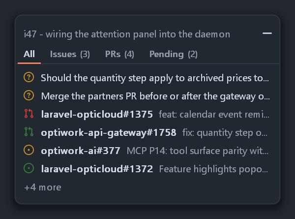
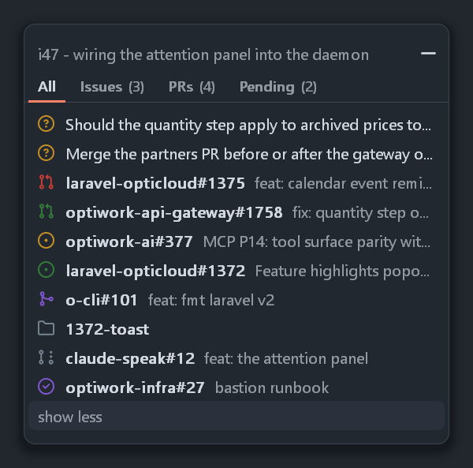
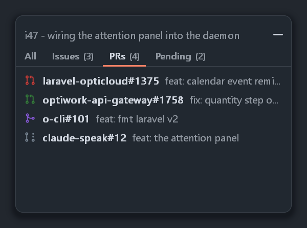
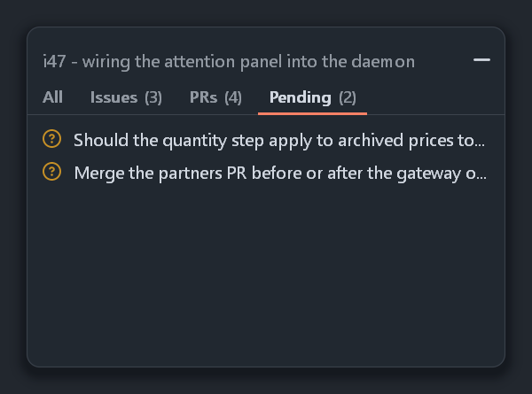
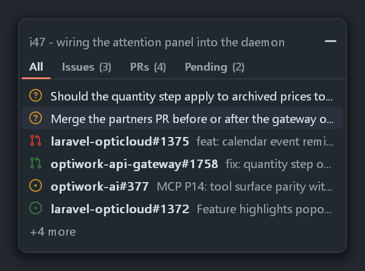
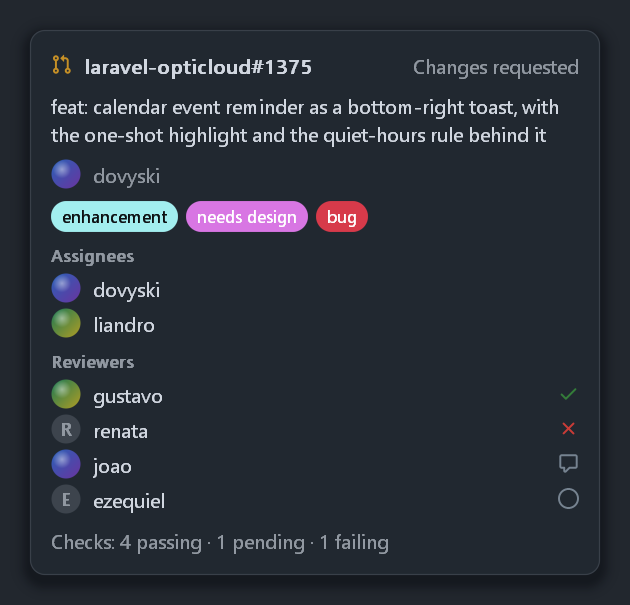
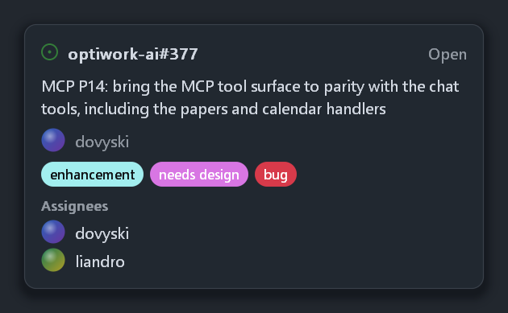
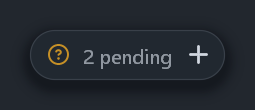
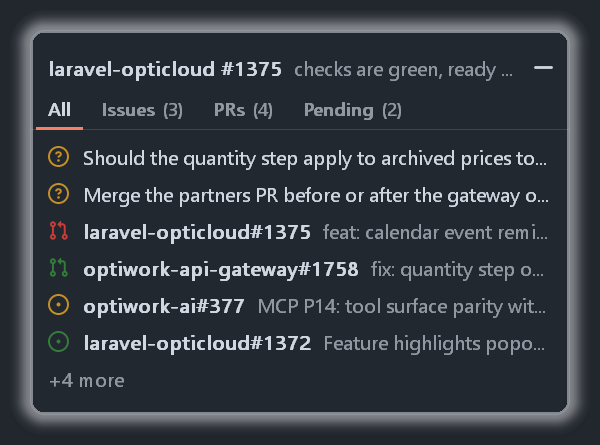
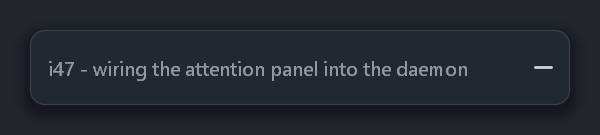

# The attention panel

Speech says *that* something happened, the rings say *where* — and both are over
in a few seconds. The panel is the part that stays: a small card parked inside
the bottom-right corner of one terminal window, listing what the session running
in it is working on.

<p align="center">
  
</p>

- [Posting one](#posting-one)
- [Rows](#rows)
- [Tabs](#tabs)
- [Pending: questions waiting on you](#pending-questions-waiting-on-you)
- [Icons and colours](#icons-and-colours)
- [Hover: the popover](#hover-the-popover)
- [The `details` contract](#the-details-contract)
- [Collapse](#collapse)
- [Speaking](#speaking)
- [Which window? (it changes)](#which-window-it-changes)
- [Following the window](#following-the-window)
- [The contract](#the-contract)
- [Where the statuses come from](#where-the-statuses-come-from)
- [Seeing it without a daemon](#seeing-it-without-a-daemon)

## Posting one

```console
$ curl -s -X POST http://127.0.0.1:8124/panel -d '{
    "session": "0a7f…",
    "title": "◑ Floating window for PR context",
    "summary": "i47 — wiring the panel into the daemon",
    "items": [
      {"kind":"pr","repo":"optidatacloud/laravel-opticloud","number":1375,
       "url":"https://github.com/optidatacloud/laravel-opticloud/pull/1375",
       "title":"feat: calendar event reminder as a toast","status":"checks_failing"},
      {"kind":"path","url":"C:\\Dev\\field\\work\\laravel-opticloud\\1372-toast",
       "title":"1372-toast"}
    ]}'
{"ok":true,"hwnd":1968562,"resolved":true}
```

Something has to make that call. For Claude Code, `hooks/` is that something — a
`Stop` and a `PostToolUse` hook that mine the session's transcript, a status
enricher the daemon runs for them, and an optional Haiku pass that prunes the
noise and collects the questions. `pwsh -NoProfile -File
hooks\install-claude-code.ps1` installs the lot;
[claude-code-integration.md](claude-code-integration.md) explains the chain, the
file formats and how to debug it.

## Rows

Each row is an icon, a short handle (`repo#1375`, or a path's last segment) and
the title, cut with an ellipsis. **Click a row** and it opens: pull requests and
issues in the browser, paths in Explorer — one `ShellExecute` does both, which is
why the two can sit in the same list. Six rows are shown; anything past that
becomes a **`+N more` row, which is itself clickable** — click it and the panel
shows everything, with `show less` on the last row to get back to six. Six is the
right default (the point is the top of a ranked list, not the whole backlog) but
not a verdict.

<p align="center">
  
</p>

A full list is capped at 70% of the target window's client height, so it can
never bury the terminal it is meant to annotate; past that it scrolls under the
mouse wheel, with a thin `#3d444d` mark at the right edge and no other scrollbar
chrome.

The wheel is fussier than it looks. A `WS_EX_NOACTIVATE` window never has focus,
and historically `WM_MOUSEWHEEL` went to the focused window rather than the one
under the pointer. Windows 10 added *scroll inactive windows when I hover over
them* and turned it on by default, which delivers the notch to the window under
the pointer — so for almost everyone the panel just gets the message. Only when
that setting is off is a `WH_MOUSE_LL` hook the alternative, and a `WH_MOUSE_LL`
hook is **global**: every mouse event on the machine round-trips through the
installing thread's message queue, and a thread that is busy drawing makes the
whole system's pointer feel late. It did, measurably, for a day. So the hook is
installed only while the pointer is over a card that can actually scroll, removed
the moment it is not, and its callback does nothing but `PostMessage` — no state,
no locks, no drawing. Swallowing the notch is still the point: scrolling the list
must not also scroll the terminal behind it.

## Tabs

`All` | `Issues (N)` | `PRs (N)` | `Pending (N)`, GitHub's underlined nav: the active tab in
`#d1d7e0` over a 2 px `#f78166` accent that replaces the hairline under itself,
the others in `#9198a1`. Clicking one filters the rows — the six-row cap, the
`+N more` row, `show less` and the scrolling all apply to the filtered list.
`All` is everything, work directories included.

<p align="center">
  
</p>

The card keeps the height of the **tallest** tab's list, so switching tabs never
moves the strip out from under the cursor — a shorter list just leaves card
underneath it. No text has to be measured to know that height: every row is one
line, so a list's height is arithmetic once the line height is known. (Adding or
removing items with a `POST` still changes it, which is fine — that is the
content changing, not the pointer's target moving.)

A tab with nothing in it is not offered, and if that leaves only `All` there is
no strip at all: the panel is six rows in the corner of a terminal, and furniture
has to earn its line. A selection whose tab has emptied falls back to showing
`All` without being forgotten, since the items may well come back.

The tab set is a table of `{id, label, predicate}`, which is how `Pending`
arrived: one row added. It is also why an item of an **unknown `kind`** is drawn
rather than refused — with a number it gets the issue glyph, without one the
folder, and it lands in `All`. A producer running ahead of this binary degrades
to a plausible row instead of a 400.

## Pending: questions waiting on you

<p align="center">
  
</p>

`kind: "question"` is a row with no repo, no number and no URL — just the
question an agent is waiting for an answer to, in `title`. It gets the
`question` Octicon in amber, the question text at full row width in the primary
ink but *not* bold (a handle is bold; a sentence is not), and it sorts to the
**top of `All`**, above everything else on the list. Clicking it copies the text
to the clipboard, which is what you want when the answer is "paste this into the
other window" — there is nowhere else for it to go, since the terminal asking is
the one you are already looking at.

Questions outrank every status in the collapsed pill: while any is open the pill
reads `N pending` with the amber `question` glyph rather than `N items` and the
worst badge. A red pill means a machine is unhappy about something; an amber one
means a machine is waiting for *you*, and only the second will not resolve
itself.

## Icons and colours

Each row is marked with **GitHub's own icon for its type**, tinted with GitHub's
own colour for its state — two pieces of information in the space a status dot
took, and the same glyph the row's page shows:

| Row | Icon | Colour |
|---|---|---|
| issue, any live state | `issue-opened` | green `#347d39`, amber `#c69026` for `changes_requested`, red `#c93c37` for `checks_failing` |
| pull request, any live state | `git-pull-request` | as above; `approved` stays plain green |
| `draft` | `git-pull-request-draft` | grey `#768390` |
| `merged` | `git-merge` | purple `#8256d0` |
| closed issue | `issue-closed` | purple `#8256d0` — GitHub's "completed" |
| closed pull request | `git-pull-request-closed` | red `#c93c37` |
| `unknown` state | its type's icon | grey `#768390` |
| `kind: question` | `question` | amber `#c69026` (grey once closed) |
| a path, or any other numberless item | `file-directory` | grey `#768390` |
| any other `kind`, with a number | `issue-opened` | by state, as above |

`approved` is left plain green rather than given a tick overlay: at 14 px a
second mark inside the glyph turns into grit, and a row's job is "which thing,
roughly how is it doing" — the exact review state is one click away.

The icons are the 16×16 [Octicons](https://github.com/primer/octicons) (MIT),
verbatim path data, rasterized in the binary: the path is parsed, its curves and
arcs are flattened to polygons, and a nonzero-winding scanline fill with four
subsample rows per pixel and exact horizontal coverage turns it into an alpha
mask. No font to ship and no bitmap to blur — which is what keeps the hole in
`issue-opened` a hole at 1×, 1.5× and 2×.

The card shares the caption toast's *material* — one rounded-rect distance field
giving the silhouette, its hairline and its shadow, and the same rasterized
fonts — but not its palette. The toast is a light notification that appears for a
sentence; this is a dark panel that lives on a dark terminal for hours, so it
takes GitHub's dark surface: `#212830` card, `#3d444d` lines, `#d1d7e0` primary
and `#9198a1` secondary text, and a hover band one step lighter at `#2a313c`.
It ignores `--caption-variant` entirely — a coloured card would claim the meaning
that belongs to the icons.

<p align="center">
  
</p>

## Hover: the popover

A row has space for a handle, a glyph and a title with its end cut off.
Everything else the enricher knows about it goes in a popover: **hover a pull
request or issue row for about a third of a second** and a second card opens to
the left of the first, aligned with the row that summoned it.

<p align="center">
  
  
</p>

Top to bottom: the type icon, `repo#N`, and the status *spelled out* (`Changes
requested`, not a coloured dot); the **full title**, wrapped to at most three
lines; the author, with their avatar; the labels as pills in GitHub's own label
colours; `Assignees`; for pull requests `Reviewers`, each with the verdict beside
them — a green check for `APPROVED`, a red `✕` for `CHANGES_REQUESTED`, a grey
speech bubble for `COMMENTED`, a hollow circle for a review that has been
requested and not yet given; and a one-line `Checks: 4 passing · 1 pending ·
1 failing`.

A row whose `details` never arrived still gets a popover — its own title and its
status, which is more than the row could show. Nothing here is interactive: the
window is `WS_EX_TRANSPARENT`, which both says "display only" and keeps
`WindowFromPoint` skipping it, so the popover cannot steal the hover that opened
it. It closes on leaving the row, on scrolling, on switching tabs, on collapsing,
and with the card itself — all of which fall out of one rule rather than five,
since the thing being watched is a *key* built from the session, the tab, the
scroll offset and the row, and any change to it restarts the dwell.

It is clamped to the monitor's work area, and if there is no room to the left of
the card (a terminal against the left edge of a narrow screen) it goes to the
right instead rather than covering the rows it is describing.

**Avatars** are local PNGs the enricher has already downloaded to
`~/.claude/attention/avatars/<login>.png`; the panel only reads them. They are
decoded with WIC on first use, scaled, cut to a circle, and cached by path,
mtime *and* diameter — the failures too, so a login whose file never arrived
costs one `GetFileAttributesEx` and one decode attempt rather than one per
frame. A missing or unreadable file falls back to a grey disc with the login's
initial, which is what every other product does for the same reason.

## The `details` contract

`items[]` may carry a `details` object, filled in by the enricher and passed
through untouched by the producer and the daemon. Every field is optional: the
enricher fills it over several passes, and a half-filled one should show what it
has.

```json
"details": {
  "title": "<the full title, before the row cut it>",
  "author":    {"login": "dovyski", "avatar": "<absolute path to a local png>"},
  "assignees": [{"login": "…", "avatar": "…"}],
  "labels":    [{"name": "bug", "color": "d73a4a"}],
  "reviews":   [{"login": "…", "avatar": "…", "state": "APPROVED|CHANGES_REQUESTED|COMMENTED|PENDING"}],
  "review_requests": [{"login": "…", "avatar": "…"}],
  "checks":    {"total": 6, "failing": 1, "pending": 1}
}
```

`reviews` is the latest review per reviewer; `review_requests` are the ones who
have not reviewed yet, and they are merged into the `Reviewers` list as
`PENDING` (a login in both keeps its review). `labels[].color` is GitHub's own
six-digit hex, with or without a `#`, and the pill's text is picked black or
white by the colour's luminance — a pill is unreadable the moment that guesses
wrong. `checks.total` counts everything, so *passing* is
`total - failing - pending`.

## Collapse

<p align="center">
  
</p>

The header is the summary line, with a `−` at the right. Click either and the
card becomes a one-line pill: how many items, and the **worst** item's icon and
colour among them.
That is enough to know whether the window wants attention, while giving the
terminal underneath its corner back.

What the card is *showing* — collapsed or not, which tab, whether the list is
fully expanded — belongs to the **session**, not to the payload: a new `POST` on
a collapsed panel bumps the pill and nothing else, and a card that hides because
its terminal tab went to the background comes back exactly as it was. A card unfolding itself
while you read the terminal is exactly what collapsing it was meant to stop.
Right click anywhere on the card toggles it too, so the gesture does not require
finding the header.

## Speaking

<p align="center">
  
</p>

When an utterance is aimed at a window — `speak.exe --title "…" "text"`, or
`--hwnd`, or `--session` — the card parked in that window's corner **glows with
the voice**: an soft white halo off its own outline, its hairline lit, intensity
riding the same amplitude envelope the orb is drawn from, so the ring in the
corner of the screen and the card in the corner of the terminal move together
rather than merely coinciding. White, deliberately, and not the ring's ember: on
the card that read as a warning rather than as a voice, and the panel already
spends red, amber and green on what its rows *mean*. (`#f0f3f6` rather than pure
white, which blooms harder than it looks against a pale terminal.) It lights with
the first sample and lets go over a second and a half
— linearly, so the halo actually reaches zero rather than merely approaching it,
with one last frame drawn when it does. The collapsed pill glows the same way, and a card that is hidden (its
terminal tab in the background) does not glow at all — there is nothing there to
light.

While it lasts, the header line carries what is being *said* instead of what the
session is working on: `--caption-title` in bold, `--caption` beside it, back to
the summary when the voice stops. What the voice is saying about this terminal is
the more urgent of the two, and it is the same line either way rather than a row
that appears and shoves the list down.

The card is matched by **resolved `hwnd`**, never by comparing titles: whichever
registration owns the card currently shown in that window is the context for that
window, which is the same rule that decided what is shown there in the first
place.

Getting the two halves to meet is the interesting part. The panel belongs to the
resident daemon, while the audio, the amplitude envelope and the caption all
belong to the one-shot client process doing the playing — and upstream's
`TTSServer` has its routes hardcoded in a file CMake downloads at a pinned SHA,
so a field on `POST /tts` was never available. So the client **broadcasts**: one
fixed-size UDP datagram every other frame (~30 Hz) to loopback on the port after
the pointing one (`8125` by default), each carrying the whole state — target
window, level, caption title and caption. No setup, no teardown, no session; the client sends a last few with
`active` clear when the voice is done, and a *gap* in the datagrams ends it too —
so a client killed mid-sentence cannot leave a card glowing forever. A stream of tiny HTTP requests at that rate would have
queued `/panel` behind it.

`GET /panels` reports it as `speaking`.

## Which window? (it changes)

A Windows Terminal window has **tabs**, and its title is the *active tab's*
title. So the window a session lives in is not a fact you can look up once: the
session whose title is `◑ Floating window for PR context` matches no window at
all while another tab is in front, and matches one again the moment its tab
comes back. Nothing in the process tree or in Windows Terminal's UI Automation
tree says which window hosts which pane, so the title is still the only handle
there is — it just has to be re-asked.

So `/panel` registers a **session**, not a window. The registration holds the
title, the items, the summary and the collapse state; the *card* is what comes
and goes:

- the title matches a window → the card is created if needed, bound to it and
  shown
- it matches nothing, or several windows → the card hides. The registration is
  untouched, and the next pass tries again
- the window is minimized, cloaked to another virtual desktop or closed → the
  card hides. Same rule, same recovery

That pass runs every ~500 ms (and immediately after a `POST`, so a card appears
at once rather than up to half a second later), enumerating the desktop once and
matching every registration against it. With nothing registered it does not run
at all, so an idle daemon does not enumerate windows for a living — and the pid
of every window it finds is turned into an image name through a cache, rather
than by taking a `TH32CS_SNAPPROCESS` snapshot of the whole machine twice a
second, which is what it used to do.

Matching is: trim, lowercase, drop a leading non-ASCII glyph *and the space
behind it* — from **both** sides, because the registered title was captured at
one instant and the window is read at another, and the two will disagree about
which way the spinner was pointing (`◐ ◑ ◒ ◓ ✳`). The space is the test, so a
title that merely starts with a non-ASCII word keeps its first letter. Then an
exact match, and only failing that a containing one, so a session whose title is
a prefix of another's still binds to its own window. Windows Terminal windows
are searched first and everything else second, which is what makes
`--panel-demo` usable against any window while developing.

Two sessions can name the same window — that is what a tab switch looks like
from here, and both registrations are perfectly valid. At most one card is shown
per window: the better match wins, and the more recently posted one breaks a tie.
The loser hides and keeps its registration, so switching back is a rebind rather
than a re-POST.

Registrations expire 48 hours after their last `POST` — long enough that a
session left alone overnight still has its panel in the morning, short enough
that a machine left running for a week is not carrying last week's windows.
`DELETE /panel?session=<id>`, and a `POST` with empty `items`, remove one at once.

## Following the window

Almost none of a card changes between frames — the shadow, the fill, the
hairline, the header rule, the icons and every glyph of text are fixed until the
content is. So they are composed once, when the card is built, into two
premultiplied layers (everything under the interactive parts and everything over
them) plus the halo's shape; and a frame is a copy, a hovered band, a glow whose
*brightness* is all that follows the voice, and the top layer. That is 0.3 ms a
frame instead of 5.5, which matters because a glowing card redraws twenty-five
times a second on the same thread that answers every panel `POST`. Nothing is
pushed to the screen at all unless the geometry, the hover, the content or the
glow actually changed: an idle daemon with a card on screen measures 0.0% of a
core.

One thread owns every panel window — they are created, drawn, bound and clicked
there, so no panel state needs a lock, and the endpoint only leaves a command
behind. Forty times a second that thread moves each bound card to the bottom
right of its target's **client** area, inset 12 px, so it never rides the tab bar
or hangs off a maximized window onto the taskbar. A move, a resize, a different
monitor or a different DPI all just work; a DPI change rebuilds the card, so it
stays the same physical size on a scaled display.

Polling rather than an `EVENT_OBJECT_LOCATIONCHANGE` hook: that hook fires for
every child of the terminal as it lays out and still says nothing about
minimizing, cloaking, retitling or death, all of which the same pass has to check
anyway. There *is* one `SetWinEventHook`, on `EVENT_SYSTEM_FOREGROUND`, and it
does one thing — re-assert `HWND_TOPMOST`, because a foreground change is when a
topmost window can end up behind something.

Hover is read from the cursor in the same pass, which needs no `WM_MOUSELEAVE`
tracking and gets occlusion for free: `WindowFromPoint` is the test, so a row
does not light up through whatever is covering it.

The window is layered, topmost, `WS_EX_NOACTIVATE` and a tool window — but
deliberately **not** `WS_EX_TRANSPARENT`, unlike the pointer: it has to receive
the clicks. `WM_NCHITTEST` returns `HTTRANSPARENT` for everything outside the
card itself, so the shadow margin does not swallow a click meant for the terminal
behind it, and `WS_EX_NOACTIVATE` keeps a click on a row from taking focus off
whatever you were typing in.

## The contract

`POST /panel`, `DELETE /panel` and `GET /panels` live on the same loopback
listener as `/point` — the next port, `8124` by default.

| Field | |
|---|---|
| `session` | required; the key a registration is remembered and deleted by |
| `title` | required; the window title to look for, matched as above |
| `summary` | optional; the header line, ellipsized around 70-odd characters. Empty falls back to `N items`, and is the whole card when `items` is empty |
| `items[]` | `kind` (`pr`, `issue`, `path`, `question`), `repo`, `number`, `url`, `title`, `status`, optional [`details`](#the-details-contract) |

`url` is optional for a `pr` or an `issue` with a `repo` and a `number` — the
daemon builds the GitHub URL — and it is the only thing a row click uses, so it
is checked before being handed to the shell: `http(s)://`, a drive-letter path or
a UNC path, and nothing else.

- Registering **always succeeds**: `{"ok":true,"hwnd":N,"resolved":true}`, or
  `{"ok":true,"hwnd":null,"resolved":false,"error":"…","candidates":[…]}` when
  the title matches nothing (or several) *at that moment*. A background tab is
  the normal case, not a failure, and throwing the payload away over it would be
  the wrong trade. `400` is kept for the things that really are wrong: a body
  that is not a JSON object, a missing `session`, a missing `title`, malformed
  `items`.
- **Empty `items` *and* an empty `summary` removes the registration**, so a
  producer never has to remember to `DELETE` when its last pull request merges.
  `DELETE /panel?session=<id>` does the same.
- An empty `items` with a `summary` is **not** a goodbye: it renders a
  header-only card — the summary line and the collapse toggle, no tab strip, no
  rows, one line tall. "Rebasing the forms PRs on dev" is worth a line in the
  corner of the terminal doing it, and a session that has not found anything to
  link yet should not have its panel taken away. Collapsed, such a card's pill
  carries the summary itself rather than `0 items`.

  <p align="center">
    
  </p>
- `GET /panels` lists what is registered — `session`, `title`, `hwnd` or `null`,
  `resolved`, the item count, `collapsed`, `tab`, `expanded_all`, `speaking` and
  `updated_at` — which is the first
  thing to look at when a card is not where it should be. It is a snapshot
  published by the resolver, so it is at most half a second stale.
- Everything answers immediately. Unlike `/point`, this is a thing that stays on
  screen rather than a gesture to wait out.

Full request and response shapes are in [http-api.md](http-api.md).

## Where the statuses come from

A row's state — approved, checks failing, merged — is `gh`'s to answer, and
polling GitHub is a script's job rather than a C++ one, so it lives in
[`hooks/i47-enrich.ps1`](../../hooks/i47-enrich.ps1). The **daemon runs it**:
every 60 s (`--enricher-interval`), only while at least one panel is registered,
started with `CREATE_NO_WINDOW` and stdio on `NUL`, one run at a time, killed if
it outlives two minutes, each start and exit code in the daemon's log.

It was a Windows scheduled task before, and that is worth naming as a trap: a
task runs `pwsh` in the interactive session, where `-WindowStyle Hidden` hides a
console *after* it has appeared. Once a minute, all day, a window flashed on
screen. `CREATE_NO_WINDOW` never creates the console in the first place.

`--enricher <path>` points somewhere else (the default is
`hooks\i47-enrich.ps1` beside the executable) and `--no-enricher` turns it off.
Running the script by hand still works and is still the way to debug it —
`-Once`, `-Session <id>`, `-Verbose`.

## Seeing it without a daemon

```bat
speak.exe --panel-preview p                        rem ten PNGs, then exit
speak.exe --panel-demo --title "reviewer worker"   rem a real panel for 20 s
```

`--panel-preview <prefix>` writes the panel straight to PNG at the screen's own
scale, from sample data covering every icon and colour, a path row, a title long
enough to be cut and two items too many so the `+N more` row appears:

| File | State |
|---|---|
| `<prefix>-expanded.png` | the default card, six rows |
| `<prefix>-hover.png` | a row lit by the hover band |
| `<prefix>-collapsed.png` | the one-line pill |
| `<prefix>-all.png` | everything, with `show less` hovered on the last row |
| `<prefix>-tabs.png` | the `PRs` tab active |
| `<prefix>-pending.png` | the `Pending` tab, two questions |
| `<prefix>-summary-only.png` | a summary and nothing else |
| `<prefix>-speaking.png` | mid-utterance: lit, the header carrying the caption |
| `<prefix>-popover-pr.png` | a fully populated pull request popover |
| `<prefix>-popover-issue.png` | the same for an issue |

The two popovers come with two generated avatar PNGs beside them, so the previews
show real decoded circles rather than the fallback disc. Every image on this page
was produced this way. Layered windows are invisible to GDI screen capture, so
rendering them is the only way to review the look — same reason `--orb-preview`
exists. (PNG rather than the previews' BMP, and with no zlib linked: a deflate
stream of *stored* blocks is legal, so the encoder is a CRC, an Adler and some
framing.)

`--panel-demo` registers that same sample data against `--title` for
`--panel-seconds` (default 20), with no daemon and no producer, and goes through
the same resolver a real panel does — so a title that matches nothing yet is not
an error, and retitling a window mid-run is a fair way to watch the card arrive.
Which is how you check that it follows a move, hides on minimize and opens a row.

## Flags

| Flag | Default | Description |
|------|---------|-------------|
| `--panel-preview <pfx>` | — | Render the panel's states to PNGs (table above) and exit |
| `--panel-demo` | — | Park a sample panel in the `--title` window |
| `--panel-seconds <s>` | `20` | How long `--panel-demo` lasts |
| `--enricher <path>` | `<exe dir>\hooks\i47-enrich.ps1` | Daemon: the status poller to run while any panel is registered |
| `--enricher-interval <s>` | `60` | Daemon: seconds between poller runs |
| `--no-enricher` | — | Daemon: never run the status poller |
| `--point-port <n>` | `port+1` | Daemon: the listener `/panel`, `/panels` and `/point` share |
| `--no-point-server` | — | Daemon: serve neither the panel nor the pointing endpoint |
