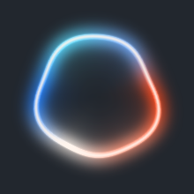

# The overlay: orb, captions and subtitles

What appears on screen while `speak.exe` talks: an audio-reactive orb in the
bottom-right corner, optionally captioned with what the utterance is about.

- [The orb](#the-orb)
- [Click to pause](#click-to-pause)
- [Captions](#captions)
- [Variants](#variants)
- [Subtitle](#subtitle)
- [Flags](#flags)
- [Screenshotting a layered window](#screenshotting-a-layered-window)

## The orb

<p align="center">
  
</p>
<p align="center"><em>silent → speaking → loud → silent</em></p>

The orb fades in with the first sample, pulses with the actual amplitude of what
the speakers are playing right now, and fades out when the audio drains. It is a
per-pixel-alpha layered window, always on top, parked above the taskbar.

<p align="center">
  
</p>

No image files or animation assets: every frame is rasterized from math into a
premultiplied-BGRA buffer and pushed to the layered window at ~60 fps. The
default `aurora` style is a luminous ring —

```
φ = θ − spin                                       ← the whole outline orbits
per angle θ:  R(θ) = R₀ + wobble·norm·( sin(3φ + 1.1c) + 0.62·sin(5φ − 0.8c)
                                      + 0.45·sin(2φ + 0.47c) + 0.6·voice·sin(7φ + 1.9c) )
              colour(θ) = ember → white → azure → cyan, rotating with t
per pixel:    dr   = distance − R(θ)
              rim  = gauss(|dr| / 1.7)      ← thin white-hot line
              glow = gauss(|dr| / 8.5)      ← wide coloured halo
              bleed= gauss(−dr / 0.5R)      ← light leaking inward (dr < 0 only)
```

Two independent drives, which is what makes it read as *listening* rather than
merely animated:

- **`voice`** is the raw audio envelope and the only thing that distorts the
  outline. `wobble = (0.085 + 0.13·voice)·voice·R₀`, so it grows superlinearly
  while talking and is exactly **zero in silence — a true circle**. The 7φ
  harmonic is scaled by `voice` too, so loud passages get sharp kinks where quiet
  ones only get broad lobes, and `c` (churn) runs the phases faster when loud.
  Amplitudes are normalized, otherwise the harmonics occasionally align and the
  ring turns into a starfish.
- **`level`** is `voice` or a slow idle breath, whichever is larger, and drives
  size and brightness — so a quiet orb still looks alive.

`voice` also decays slower than it rises (0.12 vs 0.35), otherwise the ring snaps
flat between syllables. Per-pixel polar coordinates and the Gaussian falloff are
precomputed into lookup tables, so a frame is table reads and a few multiplies —
cheap enough to ignore.

`--orb-style dot` swaps the ring for a solid core; `--orb-size <px>` sets the
square size of the overlay (default `220`) and every other size scales with it.
`--no-orb` speaks with no overlay at all — and suppresses the caption and the
subtitle with it.

`--orb-preview <prefix>` writes a strip of frames across time and loudness, which
is how the image at the top of this page was made. `--dump-orb <file.bmp>`
renders a single frame and exits.

## Click to pause

Click the ring while it is speaking and playback holds exactly where it is; click
again and it carries on from the same word. It prints `speak: paused` /
`speak: resumed` on stderr.

<p align="center">
  
</p>
<p align="center"><em>speaking → easing into the hold → paused</em></p>

The visual is the orb holding its breath: the outline settles into a true circle,
the ring contracts slightly, cools from ember towards a dim steel blue, coasts to
a near standstill, and two soft luminous bars grow out of the centre. Every part
of that is a single eased `pause` value (0→1 at 0.16/frame), so it is a settling
rather than a switch, and there is no separate "paused" drawing path.

Three details make it behave:

- **The square stays click-through.** The overlay window no longer sets
  `WS_EX_TRANSPARENT` — it has to receive the click — so `WM_NCHITTEST` returns
  `HTTRANSPARENT` for everything outside `0.36·S` of the centre, and the click
  lands on whatever is underneath. `WS_EX_NOACTIVATE` keeps the click from
  stealing focus from the window you were working in.
- **Pausing is `IAudioClient::Stop()`**, which keeps the device's buffer contents
  and position; `Start()` resumes on the very next sample. The writer also stops
  pulling from the source, so a paused stream simply stops consuming.
- **`voice` is forced to zero while held.** The playback position freezes wherever
  it was, possibly mid-syllable, and the envelope at that position would otherwise
  keep the outline distorted instead of letting it settle into a circle.

A held utterance keeps `speak.exe` alive until you click again — which also means
a caller with a timeout (an agent shell, for instance) may reap it while paused.

## Captions

<p align="center">
  
</p>

The orb says *something is speaking*. A caption says **what about**:

```bat
speak.exe --caption-title "i35 - optiwork-forms" ^
          --caption "PRs 357-364 rebased on dev, tests green." ^
          "The forms batch is ready to merge."
```

That is the default card, above: `light`, with the neutral `ⓘ`. Colour is opt-in
(see below), so a caption never claims a meaning you did not ask for.

Both text flags are optional and independent — a caption can be a title alone, a
line alone, or both. The card sits to the left of the orb, which keeps its corner;
it grows leftwards to fit the text, up to `360 px` wide, wrapping the body over at
most three lines (a fourth is cut: this is a toast, not a paragraph). Sizes scale
with `--orb-size`. Click the × to dismiss the card; the orb stays.

Quote each value as one argument — a bare
`--caption-title i35 - optiwork-forms` keeps only `i35`.

### Variants

`--caption-variant` takes the Bootstrap set, in Bootstrap's own colours, each with
an icon and with light or dark ink chosen for contrast:

<p align="center">
  
</p>

| Variant | Icon | Variant | Icon |
|---|---|---|---|
| `primary` | ⓘ | `warning` | ⚠ (ringed `!`) |
| `secondary` | ⓘ | `info` | ⓘ |
| `success` | ✓ | `light` *(default)* | ⓘ |
| `danger` | ⃠ | `dark` | ⓘ |

`--caption-icon none|check|info|warn|ban|dot` overrides the icon when the colour is
right and the glyph is not. `light` is the default: a coloured card would claim a
meaning the caller never asked for. Worth knowing that on a dark desktop the
near-white card is the **loudest** of the eight, louder than `danger`, purely from
tonal contrast — which is what you want from a notification, and why `dark` is
there for when it should recede instead.

`--caption-opacity <0-100>` scales the whole card — fill, shadow, text and all —
so it can sit further back on a busy desktop without changing its colour. It
stays legible well below `70`.

The card is deliberately **not** made of the same material as the ring. An earlier
version was — translucent glass with a hairline edge carrying the ring's
ember→white→azure palette sweeping across it, brightening with the voice — and next
to a pulsing orb it read as two things throbbing at each other, with the moving hue
fighting the text it framed. This one is flat and still: solid fill, a hairline
edge (which is what gives `light` an edge on a pale desktop), and a soft drop
shadow. Only the fade is shared with the orb, so the pair still arrives and leaves
as one object.

Every mark on it is a signed distance field: one rounded-rectangle field gives the
silhouette, the hairline and — sampled a few rows up — the shadow, and the icons
and the × are unions of line segments, so they stay crisp at any `--orb-size`.

The text is rasterized once, when the process starts: GDI cannot draw into an
alpha channel, so each string is drawn white-on-black into a scratch DIB and its
luminance becomes the coverage mask that the per-frame colours are applied
through. `ANTIALIASED_QUALITY` matters here — ClearType's subpixel antialiasing
would leave colour fringes once luminance is reinterpreted as alpha.

## Subtitle

```bat
speak.exe --subtitle "Rebasing the forms PRs on dev." "Give me a minute."
```

`--subtitle <text>` puts the words in the same strip of screen as the toast, but
bare: no card, no icon, no title, no ×. White text with a dark contour and a soft
shadow under it, wrapped to at most three lines, each one flush against the orb so
the ragged edge falls on the left — legible over whatever the desktop happens to
be showing, without a panel announcing itself. Where `--caption` is a
notification, this is a caption in the film sense: the words that go with the
voice.

The contour is a dilation of the glyph coverage — the maximum alpha inside a small
disc around each pixel — rather than a blur, so thin strokes keep a solid edge
instead of dissolving into grey. Like the card it is rasterized once and
composited with the orb's own fade, so it arrives and leaves with the ring.

`--caption` and `--subtitle` can be given together: the toast keeps the top of the
strip and the subtitle sits under it, the pair centred on the orb. `--no-orb`
suppresses both, as it always has.

## Flags

| Flag | Default | Description |
|------|---------|-------------|
| `--no-orb` | — | Skip the on-screen indicator (and the caption and subtitle with it) |
| `--caption <text>` | — | One short line of context, shown as a toast left of the orb |
| `--caption-title <t>` | — | The caption's title line, above that text |
| `--caption-variant <v>` | `light` | Toast colour: `primary`, `secondary`, `success`, `danger`, `warning`, `info`, `light`, `dark` |
| `--caption-icon <i>` | per variant | Override the icon: `none`, `check`, `info`, `warn`, `ban`, `dot` |
| `--caption-opacity <n>` | `100` | How solid the toast is, `0`–`100` |
| `--subtitle <text>` | — | Bare text in the same strip as the toast — no card, icon or title |
| `--orb-style <s>` | `aurora` | `aurora` (glowing ring) or `dot` (solid core) |
| `--orb-size <px>` | `220` | Square size of the overlay |
| `--dump-orb <file.bmp>` | — | Render a single orb frame to a BMP and exit |
| `--orb-preview <prefix>` | — | Render a strip of frames across time and loudness, and exit |

## Screenshotting a layered window

The orb is invisible to GDI screen capture (`CopyFromScreen`, `BitBlt`, even with
`CAPTUREBLT`). To capture it, use DXGI desktop duplication, e.g.

```bat
ffmpeg -f lavfi -i ddagrab=0:framerate=10 -vf hwdownload,format=bgra -frames:v 1 shot.png
```

Which is why the previews exist at all: `--dump-orb`, `--orb-preview`,
`--point-preview` and `--panel-preview` render the same pixels straight to a file,
with no capture involved.
